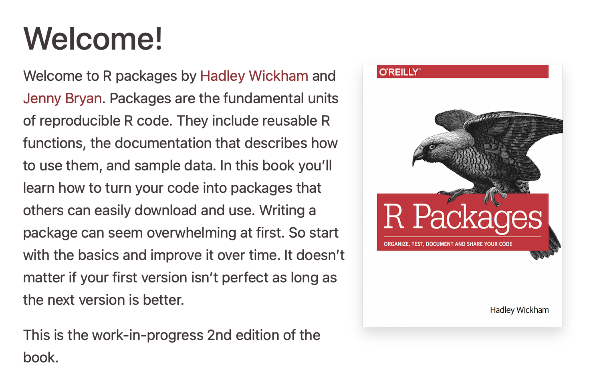

```{r setup, include=FALSE}
options(htmltools.dir.version = FALSE)
library("xaringanExtra")
htmltools::tagList(
  xaringanExtra::use_clipboard(
    button_text = "<i class=\"fa fa-clipboard\"></i>",
    success_text = "<i class=\"fa fa-check\" style=\"color: #90BE6D\"></i>",
    error_text = "<i class=\"fa fa-times-circle\" style=\"color: #F94144\"></i>"
  ),
  rmarkdown::html_dependency_font_awesome()
)
```

# Content

* R packages
* Types of packages
* How it starts?
* Should I publish my R package?
* Tips to write your package
* Tips to publish your package

---
class: middle, inverse
# R packages
---
# R packages

A collection of functions, complied code and sample data. They are stored under a directory called "library" in the R environment

Most day-to-day work will require at least one contributed package.

The Comprehensive R Archive Network [(CRAN)](https://cran.r-project.org/) is where most of the packages are

To install a package from CRAN we use the function `install.packages()`

```{r eval=FALSE, message=FALSE}
install.packages("terra")
```

---
# R packages

Develop a R package is often an ongoing project. Once a package's version is stable enough, the developer publishes it on CRAN. 

Currently, most R packages under development are deposited on [GitHub](https://github.com/). To install a developing version from GitHub we use the function `install_github()` from the R package "remotes"

```{r eval=FALSE, message=FALSE}
install.packages("remotes")
remotes::install_github("r-spatial/sf")
```

---
# Types of packages

There are many types of R packages, these packages are better sorted in the [CRAN Task Views](https://cran.r-project.org/web/views/)

* Data munging (Missing data) `tidyr`, `gapfill`, ...

* Spatial `sf`,  `terra`,  `maptools`, ...

* Machine Learning `rpart`, `party`, `randomForest`, ...

* API Client (Data retrieval) `nasapower`, `chirps`, `rgbif`, ...

---
# How it starts

A package could start by identifying a need or gap in the community. 

* The R packages `sp` (in 2005) and `raster` (2010) where developed to fill the gap in the community and changed the way we do open-source spatial analysis. 

* The package `data.table` (in 2006) was developed to solve a computational issue in R to handle large files, it saved R from extinction.

* The package `sf` (in 2016) and `terra` (in 2020) were developed to modernize spatial tools in R. A demand from The R Project.

---
# How it starts

Another way is by time. When you run a chunk of code...

* More than once in one script within a project, you write a loop


* More than once in multiple scripts within a project, you write a function


* Across multiple projects, you write a package


The idea is to have a better sense of your code, and an easier way to find bugs. Some packages are only used within the research group or lab

---
# Should I publish my R package?

Before offering your R package to the community, consider these things

* Do you know your audience? Who does the package serve? Is there a wider user other than your lab?

* Is your code well documented and tested? 

* Are you willing to maintain it?

* Have you checked if there is a similar project out there?

---
# Tips to write your package

* Use roxygen2, this will make your life really easy 

* Vectorize your functions. Start simple and write tests right away

* Document the functions with good examples and toy data

* Check other packages structures

* Use Git as tracking changes software

* Use a deploy service (e.g. Travis, Git Actions)

* Use AAA- to prioritize functions and ZZZ- to put it at the end

---
# Tips to publish your package

* Start with a good vignette 

* Some journals accept methodological or software papers

* Specialized journals are Journal of Open Source Software (JOSS), Journal of Statistical Software

* Accept software papers Methods in Ecology and Evolution, Crop Science

---
# Further reading and learning


<center>

</center>

.footnote[
[1] [Wickham (2015)](https://r-pkgs.org/index.html)]


---

# **Thank you!**

.pull-right[

[k.desousa@cgiar.org](mailto:k.desousa@cgiar.org)

<br><br><br><br><br><br><br><br><br><br>

[Back to the main page](index.html)
]
